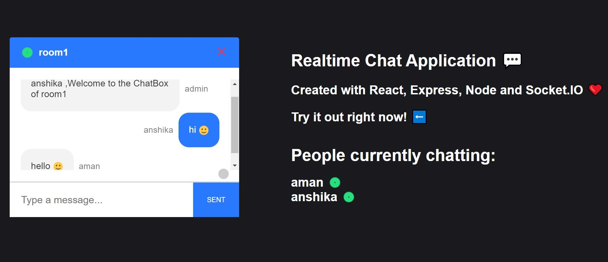

# ChatApp
A Realtime Chat Application with React on the front end, with NodeJS + Socket.io web socket library on the back end.

Application : [ChatApp2k21](https://chatapp2k21.netlify.app/)

## View of Application

     

## Current Features
* RealTime Application
* Active people visible
* Emoji Valid 
